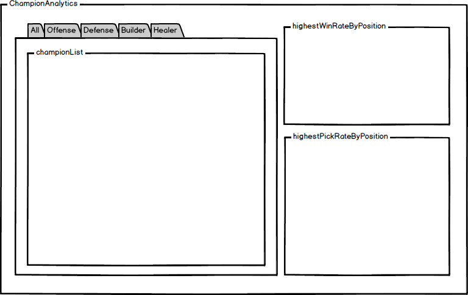

# overwatch-stats

## Background

Overwatch offers in-game statistics to current user but a user has very limited access to other users's game statistics. This single-page web application will provide users to have access to not only their own game statistics, but also all the other players' from all over the world. The stats will be shown in graphs for better readability.

## Technology Stack

Frontend | CSS

## Technical Challenges

- Blizzard does not offer API for Overwatch
    - an unofficial API from 3rd party
- Efficiently using API calls
- Showing the data in a graph format

## Wireframes

## Implementation Timeline

Phase 1: Get started with the infrastructure (1 day)
- Setting up react-redux cycle
- Successfully do AJAX requests

Phase 2: Build player and game components (1day)

Phase 3: Data into graphs (2 days)

Phase 4: CSS (2 days)

Phase 5: Polish

Phase 6: Polish, Production README
